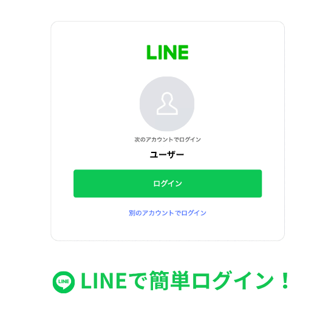
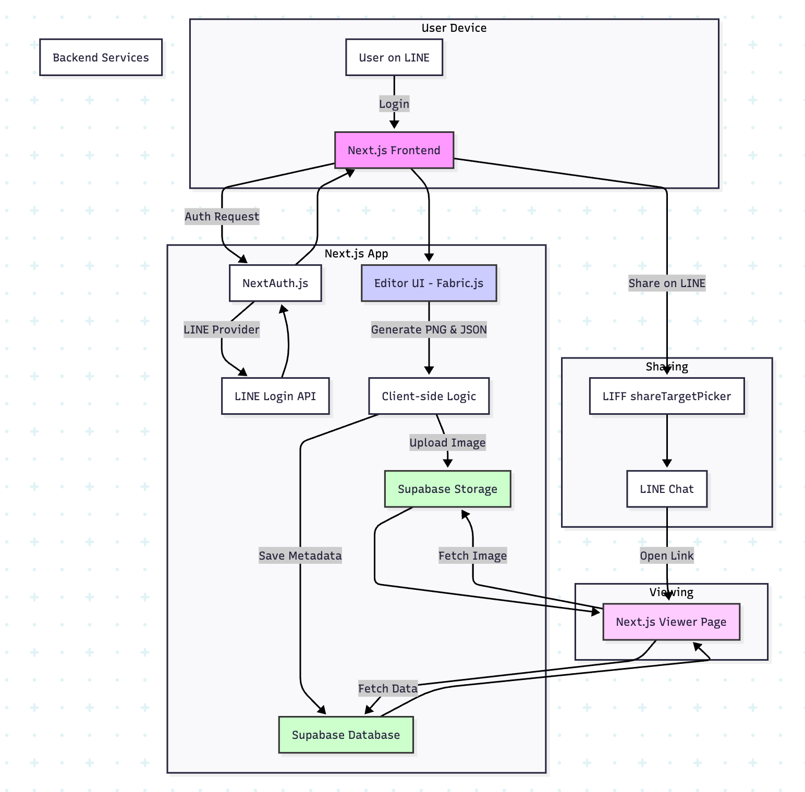

# LINE Letter

Webエディタでデザインした手紙を、LINEを通じてアニメーション付きで共有できるサービスです。

## 1. 概要 (Overview)

LINE Letterは、ユーザーがウェブ上で手軽にオリジナルのメッセージカードを作成し、LINEの友だちやグループに共有するためのアプリケーションです。豊富なテンプレートやアニメーションエフェクトを使って、心のこもったデジタルレターを作成できます。

## 2. デモ (Demo)


*(エディタ画面でテキストやエフェクトを追加し、プレビューする様子)*

## 3. 主な機能 (Features)

- **LINEログインによる簡単な認証**: 面倒な登録は不要。LINEアカウントですぐに利用を開始できます。
- **豊富なテンプレート**: 便箋のデザインとなる背景テンプレートを選択できます。
- **直感的なCanvasエディタ (PC向け)**:
  - テキストの追加・編集
  - 画像のアップロードと配置
  - アニメーションエフェクト（キラキラ、イルミネーション）の追加とカスタマイズ
- **ページごとの画像保存と共有**:
  - 作成した手紙はページごとに画像として**Supabase Storage**に保存されます。
  - 手紙全体に対してユニークな閲覧URLが生成され、LINEの**LIFF (LINE Front-end Framework)** を通じて簡単に共有できます。
- **レスポンシブ対応**: PCとモバイルで表示を切り替えます（現在モバイル版は開発中です）。

## 4. 技術スタック (Tech Stack)

このプロジェクトで使用されている主要な技術は以下の通りです。

- **Frontend**: Next.js 15 (App Router, Turbopack), React 19, TypeScript
- **Styling**: Tailwind CSS 4
- **Backend & Database**:
  - **Authentication**: NextAuth.js (LINE Provider)
  - **Image Storage**: Supabase Storage
  - **Metadata Storage**: Supabase (PostgreSQL)
- **Canvas & Animation**: Fabric.js 5.5
- **LINE Integration**: LIFF (LINE Front-end Framework)
- **Image Processing**: Sharp (サーバーサイド)

## 5. アーキテクチャ (Architecture)



認証はNextAuth.js、画像とメタデータの永続化はSupabaseを利用しています。クライアントサイドでFabric.jsを用いて生成した画像をSupabase Storageにアップロードし、そのURLをDBに保存する構成です。

より詳細なアーキテクチャやディレクトリ構造については、以下のドキュメントを参照してください。
- [**`docs/apps/ARCHITECTURE.md`**](./docs/apps/ARCHITECTURE.md)

## 6. APIエンドポイント (API Endpoints)

- `/api/auth/[...nextauth]`: NextAuth.jsによる認証エンドポイント。
- `/api/generate-image`: (現在は未使用) サーバーサイドで画像を生成するAPI。
- `/api/save-letter`: (レガシー) サーバーの一時領域に画像を保存するAPI。

## 7. セットアップと実行 (Getting Started)

### 7.1. 前提条件

- Node.js (v20.x 以上を推奨)
- npm / yarn / pnpm

### 7.2. インストール

```bash
npm install
```

### 7.3. 環境変数の設定

プロジェクトルートに `.env.local` ファイルを作成し、必要な環境変数を設定します。詳細は `docs/apps/ONBOARDING.md` を参照してください。

### 7.4. 開発サーバーの起動

開発にはTurbopackを利用した高速なサーバーが起動します。

```bash
npm run dev
```

ブラウザで `http://localhost:3000` を開いてください。
ログイン後のメイン体験はデスクトップ向けエディタ (`/pages/line-letter-desktop/editor`) に用意されています。

### 7.5. ビルドと本番起動

```bash
# ビルド
npm run build

# 本番サーバー起動
npm run start
```

## 8. 工夫した点 (Highlights)

### デジタルならではの表現力を実現する拡張性の高いエフェクト機能

手書きの手紙が持つ「温かみ」に対し、デジタルならではの付加価値として、受け取った人が驚きや楽しさを感じられる動的なアニメーションエフェクト機能を実装しました。

この機能を実現するため、Canvasライブラリである**Fabric.js**をベースに、独自の拡張を行っています。

1.  **拡張性を考慮したオブジェクト指向設計**:
    -   全てのエフェクトの基盤となるカスタムクラスを`fabric.Group`を継承して設計しました。
    -   これにより、エフェクト自体を一つのオブジェクトとしてCanvas上で操作（移動、拡大縮小など）できるだけでなく、今後新しい種類のエフェクト（例：雪、紙吹雪など）を追加する際も、共通のインターフェースを再利用でき、容易に拡張が可能になっています。

2.  **Canvasの状態の永続化と復元 (Serialization & Deserialization)**:
    -   **課題**: Fabric.jsの標準機能では、Canvas上のオブジェクトをJSONとして保存できますが、カスタムクラスのプロパティ（例：エフェクトの種類、点滅速度）や、動的なアニメーションの状態までは保存されません。
    -   **解決策**:
        -   Fabric.jsの`toObject`メソッドをオーバーライドし、独自に追加したプロパティもJSONに含めるように拡張しました。これにより、エフェクトの見た目や設定を完全にシリアライズ（文字列化）できます。
        -   JSONからCanvasを復元する際には、各オブジェクトの`type`プロパティ（例: `"sparkle-effect"`）を識別し、対応するカスタムクラスのインスタンスとして再生成します。
        -   復元後、`resume...Animation`のような専用関数を呼び出すことで、保存されていた設定値（速度、色など）に基づき、アニメーションを自動で再開させます。この仕組みにより、ユーザーが編集画面を再訪した際や、受信者が閲覧ページを開いた際に、編集時と全く同じ状態のアニメーションを再現できます。